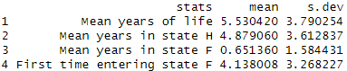

# Workflow Example

The following is an example of the general workflow of the module. It demonstrates
the order of function executions, and the different endpoint outputs. We use the following
individual characteristics:

* male
* age 87
* initial year 2022
* trend model 
* healthy 
* use parameters estimated from the US study: `US_HRS` for 3-state model and `US_HRS_5` for 5-state model


```r
# first we create a list of transition probability matrices 
trans_probs_3 <- get_trans_probs(n_states=3, model_type='T', param_file=US_HRS, init_age=87, female=0, year = 2022, latent = 0)

# using the transition probabilities, we can generate life tables
lifetable <- create_life_table(trans_probs_3, init_age=87, init_state = 0, cohort = 100000)
head(lifetable)
```
Life table generated for 3-state models:
<figure markdown>
  
</figure>

```r
# can also create a plot of mortality and disability curves
prob_plots(init_state = 0, 87, trans_probs_3)
```
Plot of survival probabilities to different states for 3-state models:
<figure markdown>
  
</figure>

Statistics for 3-state models:
```r
# from transition probabilities, we can simulate lifetime paths
sim_paths_3 <- simulate_health_state_paths(trans_probs_3, init_age=87, init_state = 0, cohort = 10000)

# all survival statistics (mean and standard deviation): 
health_stats(n_states=3, init_age=87, init_state=0, trans_probs=trans_probs_3)
```

<figure markdown>
  
</figure>

Workflow for 5-state models:
```r
# first we create a list of transition probability matrices for the 5-state model
trans_probs_5 <- get_trans_probs(n_states=5, model_type='T', param_file=US_HRS_5, init_age=87, female=0, year = 2012, wave_index = 13, latent = 0)

# using the transition probabilities, we can generate life tables
lifetable_5 <- create_life_table(trans_probs_5, init_age=87, init_state = 0, cohort = 100000)

# from transition probabilities, we can simulate lifetime paths
simulated_path_5 <- simulate_health_state_paths(trans_probs_5, init_age=87, init_state = 0, cohort = 10000)

# can also create a plot of surviving probabilities to different states
prob_plots(init_age=87, init_state = 0, trans_probs_5)

# all survival statistics (mean and standard deviation):
health_stats(n_states=5, init_age=87, init_state=0, trans_probs=trans_probs_5)

```
Life table generated for 5-state models:
<figure markdown>
  
</figure>
Plot of survival probabilities to different states for 5-state models:
<figure markdown>
  
</figure>
Statistics for 5-state models:
<figure markdown>
  
</figure>
